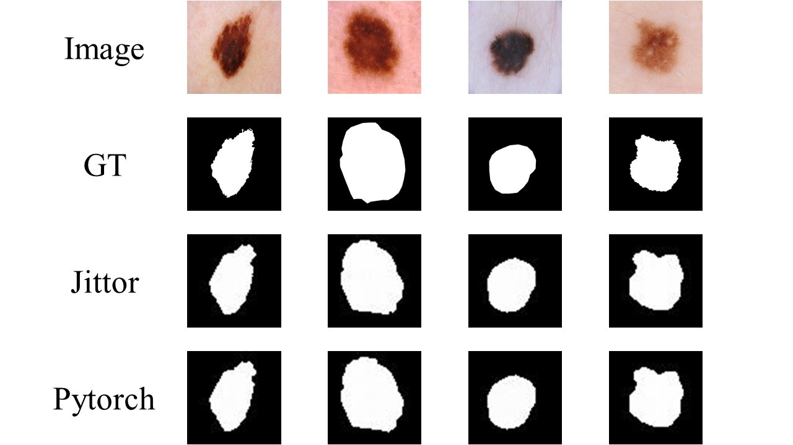
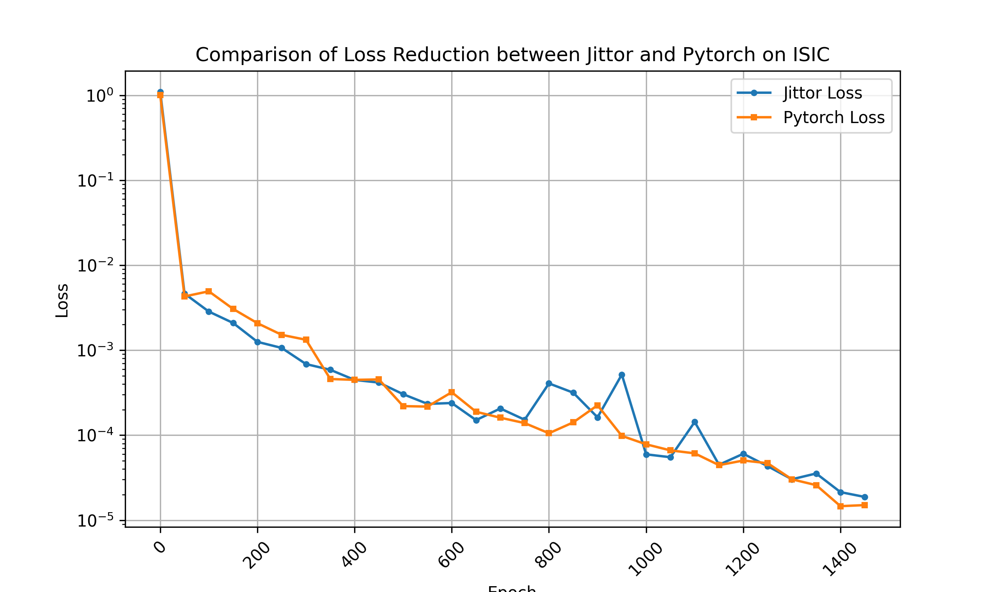

</head>
<body>
    

        <h1>MedSegDiff-Jittor</h1>
        
A Jittor re-implementation of <a href="https://github.com/WuJunde/MedSegDiff">MedSegDiff</a>, a diffusion-based model for medical image segmentation. This repository provides a high-performance Jittor version that aligns with the original PyTorch implementation in functionality and performance.
        

            <h2>🌟 Features</h2>
            <ul class="feature-list">
                <li>Full re-implementation of MedSegDiff using Jittor framework</li>
                <li>Consistent model structure and training pipeline with PyTorch version</li>
                <li>Comprehensive experiment logs to verify alignment with PyTorch results</li>
                <li>Support for ISIC dateset.</li>
                <li>In the paper, the author used 4 Tesla P40 GPUs with 24GB for training. Due to resource limitations, I only trained and tested on RTX 4090 24GB.
            </ul>
        

        

            <h2>📋 Environment Setup</h2>
            <h3>Prerequisites</h3>
            <ul>
                <li>jittor==1.3.8.1
                <li>numpy
                <li>pandas
                <li>blobfile
                <li>nibabel
                <li>opencv-python
                <li>scikit-image
                <li>scikit-learn
                <li>matplotlib
                <li>batchgenerators
            </ul>
        

            <h2>📊 Data Preparation and Loading</h2>
            <h3>Supported Datasets</h3>
            <ul>
                <li>Melanoma Segmentation from Skin Image-ISIC downlload from https://challenge.isic-archive.com/data.
            </ul>
            <h3>Data Load</h3>
            <ul>
                <li>The dataset loading script can be found: ./guided_diffusion/isicloader.py
            </ul>
        

        

            <h2>🏋️ Training、Testing and Evaluating</h2>
            <h3>Training Script</h3>
            
Use <code>./scripts/segmentation_train.py</code> to start training:

            

                <code>python scripts/segmentation_train.py --data_dir (where you put data folder)/data/training --out_dir output data direction --image_size 64 --num_channels 128 --class_cond False --num_res_blocks 2 --num_heads 1 --learn_sigma True --use_scale_shift_norm False --attention_resolutions 16 --diffusion_steps 100 --noise_schedule linear --rescale_learned_sigmas False --rescale_timesteps False --lr 1e-4 --batch_size 16</code>
            

            <h3>Testing Script</h3>
            
Use <code>./scripts/segmentation_sample.py</code> to start testing:

            

                <code>python scripts/segmentation_sample.py --data_dir (where you put data folder)/data/testing --out_dir output data direction --model_path saved model --image_size 64 --num_channels 128 --class_cond False --num_res_blocks 2 --num_heads 1 --learn_sigma True --use_scale_shift_norm False --attention_resolutions 16 --diffusion_steps 100 --noise_schedule linear --rescale_learned_sigmas False --rescale_timesteps False --num_ensemble 1</code>
            

            <h3>Evaluating Script</h3>
            
Use <code>./scripts/segmentation_env.py</code> to start evaluating:

            

                <code>python scripts/segmentation_env.py --pred_path (where you put prediction) --gt_pred (where you put ground truth)</code>
                
    
        

        

            <h2>📝 Experiment and Performance Logs (Alignment with PyTorch)</h2>
            
We verified that the Jittor implementation achieves comparable performance to the original PyTorch version on ISIC:

            <table>
                <tr>
                    <th>Implementation</th>
                    <th>Mean IoU</th>
                    <th>Mean DSC (Whole Tumor)</th>
                </tr>
                <tr>
                    <td>PyTorch</td>
                    <td>80.45%</td>
                    <td>88.48%</td>
                </tr>
                <tr>
                    <td>Jittor</td>
                    <td>80.50%</td>
                    <td>88.52%</td>
                </tr>
            </table>
            
            
            The specific experimental logs can be found in: ./log.
        

    

</body>
</html># MedSegDiff-Jittor
